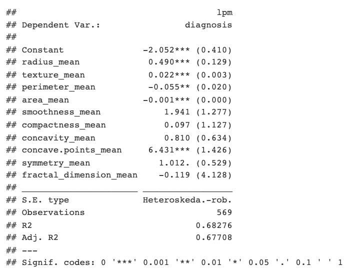
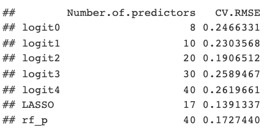
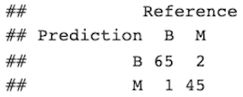
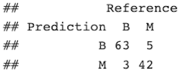

<h2>Purpose and Overview</h2>
This project was a final assignment for my Economic Forecasting (ECON 427) class in which we were given the prompt of "create something with data science". To this end, I wanted to try my skills at classification. In this project, I built a linear probability model (LPM), logistic regression (logit), and random forest models to classify whether a patient had a benign or malignant diagnosis.

<h3>Dataset</h3>

  <figure class="figure w-20 float-start m-2">
    
  </figure>
  
For this project, I used the open-source [Breast Cancer Wisconsisn (Diagnostic) Data Set](https://www.kaggle.com/datasets/uciml/breast-cancer-wisconsin-data?resource=download). This is a dataset comprising of breast cancer tumor data from the UC Irvine Machine Learning repository hosted on [Kaggle.com](https://www.kaggle.com/). Features are computed from digitizing img/projects/BC_class_in_R of a fine needle aspirate (FNA) of a breast mass. These features are descriptors of the cell nuclei displayed in the image. The dataset is also relatively small, comprising of only 569 total entries (357 benign, 212 malignant). It has 32 columns: the first two are ID number and classification (benign/malignant), with the other 30 being calculated mean, standard error, and largest values of each composite image. These values are pre-computed; the original dataset of individual image samples is unavailable.

<h3>Preparatory Analysis</h3>
Because of the dataset's small size, and partly because I wanted to experiment, I used feature expansion to test if the logit models trained on more parameters would work better. Furthermore, I used the LASSO algorithm to compute which features, among those from the original features in the dataset and those from feature expansion, would be the most statistically significant in determining diagnosis.

One thing to note is that, because of the dataset's small size, it has relatively low external validity and is prone to overfitting. For this reason, this project is used more as an exercise in data science rather than building actually usable models.

<h3>LPM</h3>

To begin, I made a simple LPM to see which of the included raw features had the most significance. According to the LPM, the _concave points_ and _fractal dimension_ features were the most significant.

<h3>Logit Models</h3>
Then, I built 5 different logit models, each with a different set of variables. For example, the first logit model, _logit0_, would be built only on the provided raw feature variables. Each subsequent model would be given more features obtained through the preparatory feature expansion. Using the final, and largest, set of features, I used the LASSO algorithm of feature selection to build a sixth model. Finally, all of the models were evaluated on 5-fold cross-validation RMSE. Additionally, a confusion matrix was computed for the best logistic regression model (LASSO) and compared to the random forest classifier discussed below. 

<h3>Random Forests</h3>
Afterwards, I tried building random forest models for both probability and classification. These forests build on the largest set of features and the split rule was the Gini Impurity. and were evaluated on a 5-fold cross-validation RMSE (for the probability forest) and a confusion matrix (for the classification forest).

<h3>CV RMSE</h3>

  <figure class="figure w-30 float-start m-2">
    
  </figure>
  
In terms of cross-validated RMSE, the LASSO model performed the best, followed by random forest. Interestingly, the next best model was _logit2_ with 20 predictors, which is similar in number to the LASSO-built model with 17 predictors.

<h3>Confusion Matrices</h3>

  <figure class="figure w-30 float-start m-2">
    
    <h5>LASSO Model Confusion Matrix</h5>
  </figure>
  <figure class="figure w-30 float-end m-2">
    
    <h5>Random Forest Confusion Matrix</h5>
  </figure>

 
 
 
 
 
 
 
 
The confusion matrix for the LASSO model was calculated with a naive threshold of 0.416, which was the mean predicted probability value. When comparing the two, the LASSO model outperformed the random forest classifier with a F1 score of 0.95744 against the random forest F1 score of 0.93104.

<h2>Conclusions</h2>
Overall, this project was an excellent experience in dabbling into data science projects, as well as planning and executing the data analysis by myself. However, I did not make any ROC or AUROC curves, and I did not have the technical experience to try a GBM model. In my future endeavors, I hope to perform a more thorough analysis that includes these elements, if appropriate.

<h2>Links</h2>
View the open-source [breast cancer dataset](https://www.kaggle.com/datasets/uciml/breast-cancer-wisconsin-data?resource=download).

View the full project write-up, including source code, <a href="../documents/BC_class_in_R_report.html">here</a>.
